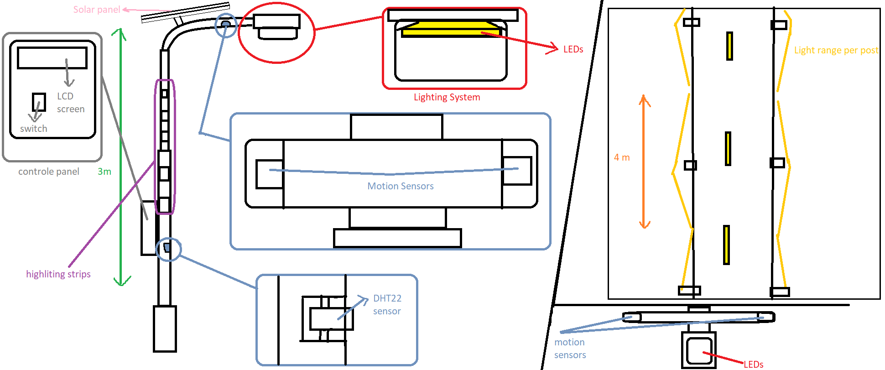

# Micro Bit Journey

Between 2021 and 2023, during my high school years, I participated in several robotics competitions that shaped my early experience with engineering and coding. The most notable were three competitions under the title [Do Your Bit](https://microbit.org/teach/do-your-bit/), founded by the UN and BBC.

After extensive research, development, and design work, I became a two‑time Middle East Champion in 2021 and 2022, and in 2023 I won the National Best Code Award.

## Content

This repository contains the designs, code, and presentations for each project.  
All code was originally developed using the micro:bit block‑coding language on [Microsoft makecode for micro:bit](https://makecode.microbit.org/) and then translated into Python using the same tool. You can also view the block format by uploading the `.hex` files to the makecode online editor.

### Automatic Tree Farm (2021)

**Mission Statement:** _Automating reforestation to fight climate change by building smart, scalable tree farms that restore ecosystems after bushfires._

**Automatic Tree Farm** is a large‑scale reforestation system designed to combat the effects of bushfires and rising CO₂ levels. The project leverages a network of micro:bits to automate soil humidity monitoring, temperature tracking, watering, and camera control within an indoor vertical farm. Each farm unit grows trees in three stacked layers, with sensors and servo motors ensuring optimal growth conditions under human supervision. When replanting is needed after bushfires, the farm provides a ready supply of healthy trees, reducing recovery time and supporting climate action (Goal 13). Future updates aim to integrate automated nutrient management and a mechanical grabber system to transport and plant trees directly in affected areas, making the farm a scalable and sustainable solution for environmental restoration.

#### Features

- **Vertical tree farming design**: three stacked layers, each with six trees.
- **Automated humidity monitoring**: micro:bit sensors trigger watering when soil moisture drops below 40%.
- **Temperature tracking**: real‑time monitoring displayed via servo motor in the control room.
- **Smart watering system**: water pump activated for 15 seconds when needed.
- **Camera control network**: servo motors adjust camera angles for supervision.
- **Radio‑linked micro**:bit communication: seamless coordination between sensors, pumps, and cameras.
- **Human oversight**: centralized control room ensures safety and reliability.
- **Future expansion**: automated nutrient feeding and mechanical grabber for large‑scale replanting.

### Room Monitoring System (2022)

**Mission Statement:** _Creating healthier indoor environments by monitoring air quality and protecting people from passive smoking risks._

**Room‑Monitoring System** is an indoor health and safety solution designed to reduce the harmful effects of smoking in enclosed spaces such as restaurants and coffee shops. The system uses a network of micro:bits connected to sensors that track temperature, humidity, and smoke levels. Data from multiple sensing units is averaged and displayed on a monitoring panel, which alerts staff when conditions become unsafe. By guiding actions such as opening windows, adjusting AC, or activating ventilation, the system helps maintain a healthier atmosphere and reduces the risk of virus transmission linked to poor air quality. Future upgrades aim to integrate advanced chemical sensors, AI‑driven automated responses, and mobile app connectivity, making the system scalable for hospitals, homes, and other public spaces.

#### Features

- **Distributed sensing units**: each room contains at least two micro:bit units with temperature, humidity, and smoke sensors.
- **Central monitoring panel**: calculates and displays average values for all monitored aspects.
- **Season‑based settings**: winter and summer thresholds adjust alerts depending on common viruses and climate.
- **Alert system**: red LEDs indicate unsafe levels of temperature, humidity, or smoke.
- **Reaction guide**: clear instructions for staff to take corrective actions (ventilation, AC adjustment, window opening).
- **Scalable design**: number of sensing units increases with room size.
- **Future expansion**: advanced chemical sensors, AI‑driven automation, app integration, and broader use cases in hospitals and homes.

### Mi-Light (2023)

**Mission Statement:** _Reducing light pollution and its harmful effects through smart, sustainable, and adaptive lighting systems._

**Mi‑Light** is a smart road‑lighting solution designed to tackle the global issue of light pollution, which negatively impacts human health, wildlife, aquatic ecosystems, and the environment. The system uses micro:bits connected to sensors that monitor motion, light levels, humidity, and temperature to dynamically adjust streetlight brightness. Each pole is powered by solar energy, ensuring zero carbon footprint, while adaptive lighting reduces unnecessary energy use and minimizes pollution. By dimming when no movement is detected, brightening during fog or rain, and coordinating across poles to light only when needed, Mi‑Light creates safer roads while protecting ecosystems. Future upgrades aim to integrate IoT connectivity, AI‑driven sensing, and broader applications in hospitals, homes, and industrial settings.

#### Features

- **Smart motion detection**: lights brighten when movement is detected, dim when idle.
- **Adaptive brightness control**: adjusts intensity based on fog, rain, or night conditions.
- **Solar‑powered poles**: each unit sustains itself with renewable energy, ensuring no carbon footprint.
- **Efficient coverage**: lights activate in sequence, maintaining visibility while reducing excess illumination.
- **Integrated sensors**: humidity, temperature, light, and motion sensors feed real‑time data to the system.
- **LCD monitoring panel**: displays climate constants and sensor readings for reliability.
- **Safety design**: poles covered with reflective strips to prevent collisions.
- **Future expansion**: IoT connectivity, AI‑enhanced sensing, and applications beyond roads (hospitals, houses, factories).

## Links:

- Do your Bit 2021:
  https://microbit.org/teach/do-your-bit/winners/2021/
  https://microbit.org/news/2021-10-10/teenager-designs-tree-farm-controlled-by-microbits/
- Do your Bit 2022:
  https://microbit.org/teach/do-your-bit/winners/2022/#:~:text=Shanice%2C%20the%20do%20your%20%3Abit%20winner%20from%20Kenya
- Do your Bit 2023:
  https://www.facebook.com/TabletAcademyMENA/posts/751022446813983/
